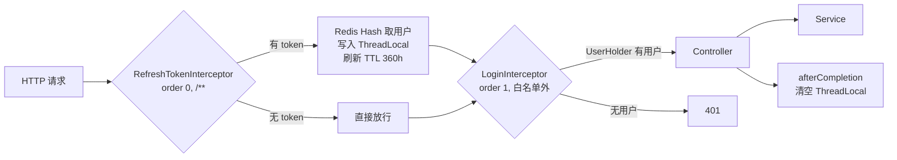
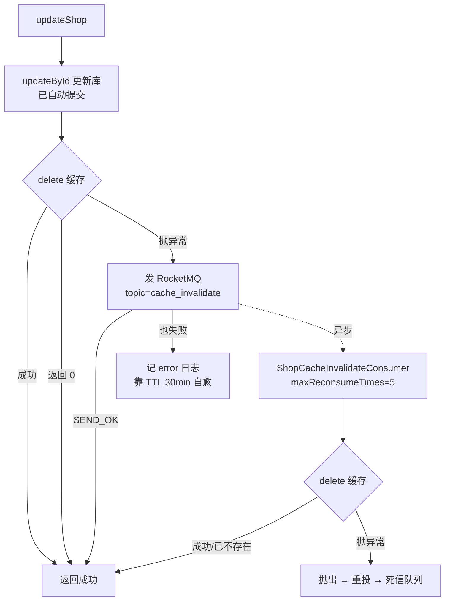
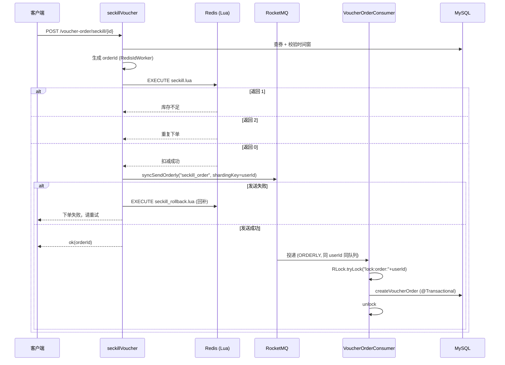
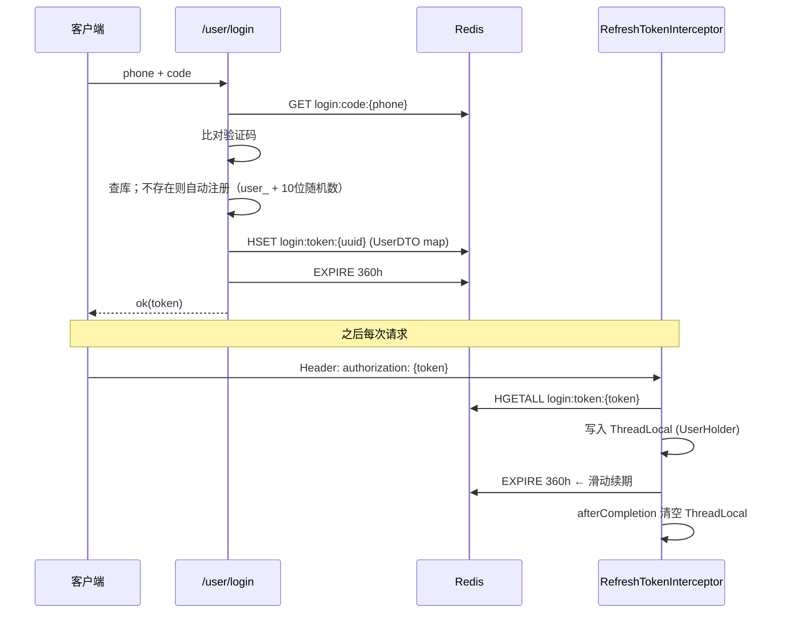

# 黑马点评 ReviewNest

> 基于 Redis 的本地生活点评系统全栈项目。以 **「缓存问题 → 秒杀问题 → 消息补偿」** 为主线逐提交演进，每个方案都保留了前一代实现作对照。
>
> 后端：Spring Boot 3.2 / Java 17 / MyBatis-Plus / Redis / Redisson / RocketMQ
> 前端：nginx 静态页面（非 React / Vue 工程）

---

## 目录

- [一、项目定位与演进时间线](#一项目定位与演进时间线)
- [二、技术栈](#二技术栈)
- [三、目录结构](#三目录结构)
- [四、快速启动](#四快速启动)
- [五、踩坑清单（本机环境如实记录）](#五踩坑清单本机环境如实记录)
- [六、后端架构](#六后端架构)
- [七、接口一览](#七接口一览)
- [八、核心场景详解](#八核心场景详解)
- [九、方案对比与取舍](#九方案对比与取舍)
- [十、已知问题与技术债](#十已知问题与技术债)
- [附录](#附录)

---

## 一、项目定位与演进时间线

这不是一个"写完就算"的项目，而是一份 **可复现的演进记录**：每一版方案的代码都还在，被注释掉的前一版就贴在旁边。想搞清楚"为什么后来换成这个写法"，直接看代码对照即可。

| 提交 | 内容 | 引入的核心技术点 |
|---|---|---|
| `42cd6f4` | 黑马点评短信登陆 | Spring Boot + MyBatis-Plus + Redis 验证码 |
| `01d34db` | 访问任何页面都要刷新 token（拦截器） | 双拦截器 + ThreadLocal |
| `c43400e` | 缓存穿透（返回 null + TTL）、击穿（互斥锁、逻辑查询） | Cache-Aside、互斥锁、逻辑过期 |
| `4fdea4c` | 热点 key 的穿透/击穿/雪崩；优惠券秒杀、一人一单、超卖 | Lua 原子脚本、Redisson、RedisIdWorker |
| `e2523dc` | 新增 nginx 前端、RocketMQ docker 配置、Redis 总结笔记 | 全栈化、RocketMQ |
| `42d2873` | 调整仓库结构：backend 与 frontend 目录并列 | — |
| `2eceaa2` | 使用 MQ 做删除缓存失败的异步补偿 | 缓存一致性补偿 |

**配套文档**：[`backend/Redis数据结构应用总结.md`](backend/Redis数据结构应用总结.md) —— Redis 数据结构逐个场景的用法总结，与本 README 互补。本 README 侧重「为什么这么做」和工程细节，那份侧重「每个数据结构用在哪」。

---

## 二、技术栈

| 类别 | 选型 | 版本 | 用途 |
|---|---|---|---|
| 语言 / 运行时 | Java | 17（`pom.xml` 声明；本机实测 21 可编译） | — |
| 框架 | Spring Boot | 3.2.0 | Web、拦截器、AOP |
| 构建 | Maven | — | `spring-boot-maven-plugin` 排除了 lombok |
| ORM | MyBatis-Plus | 3.5.5（`mybatis-plus-spring-boot3-starter`） | CRUD、分页、条件构造器 |
| 数据库 | MySQL | — | 主存储，utf8mb4 |
| 缓存 | Spring Data Redis | Boot 管理 | 全部缓存 / 分布式能力 |
| 连接池 | commons-pool2 | Boot 管理 | Lettuce 连接池 |
| 分布式锁 | Redisson | 3.27.2 | 可重入锁（秒杀一人一单兜底） |
| 消息队列 | RocketMQ | rocketmq-spring-boot-starter 2.3.6 / 服务端 5.3.1 | 秒杀下单异步化、缓存删除补偿 |
| 工具 | Hutool | 5.8.27 | JSON、Bean 拷贝、随机数 |
| 简化 | Lombok | Boot 管理 | `@Data`、`@Slf4j` |
| AOP | aspectjweaver | Boot 管理 | 事务代理 |
| 前端 | nginx | 发行版整体入库 | 静态页面托管 |

---

## 三、目录结构

```
ReviewNest/
├── backend/                          # 后端（Spring Boot）
│   ├── pom.xml
│   ├── Redis数据结构应用总结.md       # 配套笔记
│   ├── docker/rocketmq/
│   │   ├── docker-compose.yml         # namesrv + broker + dashboard
│   │   └── broker.conf                # ⚠ 含硬编码本机 IP
│   └── src/main/
│       ├── java/com/hmdp/
│       │   ├── config/                # 拦截器、异常处理、分页、Redisson
│       │   ├── controller/            # 8 个 Controller
│       │   ├── dto/                   # Result / ScrollResult / LoginFormDTO / UserDTO
│       │   ├── entity/                # 10 张表
│       │   ├── mapper/                # MyBatis-Plus Mapper
│       │   ├── mq/                    # RocketMQ 生产者调用 + 2 个 Consumer
│       │   ├── service/ + impl/
│       │   └── utils/                 # CacheClient / LockImpl / RedisIdWorker 等
│       └── resources/
│           ├── application.yaml
│           ├── db/hmdp.sql            # 建表 + 示例数据
│           ├── mapper/                # 自定义 SQL（如 queryVoucherOfShop）
│           ├── seckill.lua            # 秒杀核心脚本
│           ├── seckill_rollback.lua   # MQ 发送失败回补脚本
│           └── unlock.lua             # 安全解锁脚本
└── frontend/                         # ⚠ nginx 发行版整体，含 nginx.exe，共 17M
    ├── nginx.exe
    ├── conf/nginx.conf
    └── html/hmdp/                    # 静态页面（index/login/shop-detail/blog-edit …）
```

---

## 四、快速启动

### 4.1 前置依赖

| 依赖 | 版本 / 地址 | 说明 |
|---|---|---|
| JDK | 17+ | 本机 21 已验证可编译 |
| Maven | 3.x | — |
| MySQL | — | 库名 `hmdp`，账号 `root / root123`（见 `application.yaml`） |
| Redis | 6.2+ | `localhost:6379`，**无密码** |
| Docker | — | 跑 RocketMQ |
| RocketMQ | 5.3.1 | `apache/rocketmq:5.3.1` + `apacherocketmq/rocketmq-dashboard:latest`，需**先拉镜像** |

> **JDK 版本不一致说明**：`pom.xml` 里 `java.version=17`，本机装的是 JDK 21。Maven 会以 17 为编译目标，实际用 21 跑，目前一切正常；若换机器请先确认 Maven 用的 JDK。

### 4.2 启动顺序

**① MySQL**

```bash
mysql -uroot -p -e "CREATE DATABASE hmdp DEFAULT CHARSET utf8mb4;"
mysql -uroot -p hmdp < backend/src/main/resources/db/hmdp.sql
```

`hmdp.sql` 含 11 张表 + 示例数据（14 家商铺等）。

**② Redis** —— 默认端口即可，无需配置。

**③ RocketMQ**

```bash
cd backend
docker compose -f docker/rocketmq/docker-compose.yml up -d
```

| 组件 | 端口 |
|---|---|
| NameServer | `9876` |
| Broker | `10909` / `10911` / `10912` |
| Dashboard | `8086`（容器内 8082） |

Topic / 消费组**无需手动创建**：`broker.conf` 里 `autoCreateTopicEnable=true`、`autoCreateSubscriptionGroup=true`。

**④ 后端**

```bash
cd backend
mvn spring-boot:run          # 端口 8081
```

**⑤ 前端**

```bash
# 先按 §5.1 处理图片上传目录，再启动 nginx
cd frontend
./nginx.exe
```

浏览器访问 http://localhost/ ，进入 `hmdp/` 目录下的静态页面。

### 4.3 关键配置速查（`backend/src/main/resources/application.yaml`）

```yaml
server.port: 8081
spring.datasource.url: jdbc:mysql://127.0.0.1:3306/hmdp?useSSL=false&serverTimezone=UTC
spring.data.redis.host: localhost / port: 6379 / password: (空)
spring.data.redis.lettuce.pool: max-active 10, max-idle 10, min-idle 1, 驱逐 10s
spring.jackson.default-property-inclusion: non_null   # JSON 忽略非空字段
mybatis-plus.type-aliases-package: com.hmdp.entity
logging.level.com.hmdp: debug
rocketmq.name-server: 127.0.0.1:9876
rocketmq.producer.group: seckill_producer_group
rocketmq.producer.send-message-timeout: 3000          # 快速失败，便于回补
rocketmq.producer.retry-times-when-send-failed: 0     # 不内部重试，语义干净
```

> `send-message-timeout: 3000` + `retry-times-when-send-failed: 0` 是刻意为之：**宁可快速失败交给调用方处理，也不在 SDK 内部默默重试**——否则调用方无法判断真实结果，回补逻辑会失效。

---

## 五、踩坑清单（本机环境如实记录）

> 这一节是本 README 里最实用的部分。以下每一项都是**当前仓库真实存在的问题**，不是假设。

### 5.1 ⚠ 图片上传目录指向仓库外的另一个 nginx

`SystemConstants.IMAGE_UPLOAD_DIR` 硬编码为：

```java
public static final String IMAGE_UPLOAD_DIR = "C:\\code\\java\\redis-study\\nginx-1.18.0\\html\\hmdp\\imgs\\";
```

注意这是 `nginx-1.18.0\html\hmdp\imgs\`，**不是**本仓库的 `frontend\html\hmdp\imgs\`。

- 换机器 / 路径不同 → `POST /upload/blog` 直接抛 `IOException` → 返回 `Result.fail("文件上传失败")`
- 改的时候要么改常量，要么把这个目录软链 / 复制成本地 nginx 的 `imgs`

### 5.2 ⚠ RocketMQ `broker.conf` 硬编码局域网 IP

```
brokerIP1=192.168.15.173
```

Broker 注册给 NameServer 的地址是**宿主机局域网 IP**，不是容器内 IP。原因（配置文件里已有注释）：这个地址必须同时被两边连通——

- 宿主机应用经 Docker `0.0.0.0:10911` 端口映射进 broker 容器
- dashboard 容器在 `rocketmq` 网络里跨子网连宿主机的这个 IP

`127.0.0.1` 会让 dashboard 查不到消息；`host.docker.internal` 容器内可连但宿主机解析不到。**换网络后局域网 IP 变，必须同步改这一行**（`ipconfig` 查）。

配置文件末尾给了一个一劳永逸的方案：改用服务名 `broker` + 在 Windows hosts 里加 `127.0.0.1 broker`（需管理员权限改一次）。

### 5.3 ⚠ 数据库密码硬编码

`application.yaml` 里是 `root / root123`，本机 MySQL 就是这个配置。换机器需同步。

### 5.4 ⚠ Redisson 地址与 Spring 配置重复且独立

`RedissonConfig` 里写死 `redis://127.0.0.1:6379`，**没有**从 `spring.data.redis` 读取。两处地址若不一致会静默指向不同实例（本仓库恰好都是 6379，所以没暴露问题）。

### 5.5 ⚠ frontend 目录把 nginx 发行版整体提交了

`frontend/` 共 17M，含 3.6M 的 `nginx.exe`、`contrib/`、`docs/` 等无用内容。`.gitignore` 目前只排除了 `.idea/` 和 `.zcode/`。

### 5.6 ⚠ JDK 版本声明与实际不一致

`pom.xml` 声明 17，本机 21。编译通过，但 `mvn` 走的是本机 JDK 21。

### 5.7 其余零散硬编码

| 位置 | 硬编码 |
|---|---|
| `queryWithMutex` | `"lock:shop:" + id`（`LOCK_SHOP_KEY` 常量已定义但没用） |
| `BlogServiceImpl` | `BLOG_LIKED_KEY` / `FEED_KEY` 用 `static import`，其它地方用全限定 |
| `FollowServiceImpl` | `"follow:" + userId` 字面量，无常量 |
| `ShopTypeServiceImpl` | `"cache:shopTypeList"` 字面量，无常量 |
| `VoucherOrderServiceImpl` | topic `"seckill_order"` 字面量，生产端与消费端各写一次 |
| `UserController` | `POST /user/logout` 直接返回 `Result.fail("功能未完成")` |

---

## 六、后端架构

### 6.1 请求链路



**两个拦截器为什么不能合成一个？** 因为职责是正交的：

| 拦截器 | 作用 | 路径 | order |
|---|---|---|---|
| `RefreshTokenInterceptor` | 解析 token → 写 `ThreadLocal` → **滑动续期** | `/**` | **0（先）** |
| `LoginInterceptor` | 只校验 `UserHolder.getUser()` 是否为 null → 401 | 排除 `/shop/**` `/user/code` `/user/login` `/user/me` `/voucher/**` `/shop-type/**` `/upload/**` `/blog/hot` | **1（后）** |

`order` 的顺序是硬性的：`LoginInterceptor` 依赖 `RefreshTokenInterceptor` 先把用户塞进 `ThreadLocal`，反过来就永远 401。

**两处刻意的"注释掉"**：

1. `LoginInterceptor` / `RefreshTokenInterceptor` 的 `@Component` 都被注释了，改由 `MvcConfig` 里 `new` 出来注册——因为它们需要注入 `StringRedisTemplate`，用构造器注入避免 `@Resource` 时序问题。
2. `RefreshTokenInterceptor` 里两段 `response.setStatus(401); return false;` **被注释掉了**，token 为空或用户不存在时都是 `return true` 放行。这是刻意为之：让匿名请求能访问 `/blog/{id}` 这类页面，由业务代码自己判空（如 `BlogServiceImpl.isLiked()` 开头就 `if (user == null) return;`）。**代价**：`/blog/of/me` 这类必须登录的接口若匿名调用，会 NPE 走到全局异常处理返回"服务器异常"。

### 6.2 包结构职责

| 包 | 职责 |
|---|---|
| `config` | `LoginInterceptor` / `RefreshTokenInterceptor` / `MvcConfig` / `WebExceptionAdvice` / `MybatisConfig`（分页插件）/ `RedissonConfig` |
| `controller` | 纯路由，不含业务 |
| `service` + `impl` | 业务逻辑；`ServiceImpl<Mapper, Entity>` 统一继承 MyBatis-Plus |
| `mq` | RocketMQ 消费者 + 消息体 |
| `utils` | Redis 常量、缓存模板、分布式锁、雪花替代发号器、密码、正则、`UserHolder` |

### 6.3 统一返回与异常

```java
public class Result {
    private Boolean success;
    private String errorMsg;
    private Object data;
    private Long total;
}
```

> 注意：**没有 `code` 字段**，只有 `success` + `errorMsg`。判断成败看 `success`。

全局异常只处理了 `RuntimeException`：

```java
@RestControllerAdvice
public class WebExceptionAdvice {
    @ExceptionHandler(RuntimeException.class)
    public Result handleRuntimeException(RuntimeException e) {
        log.error(e.toString(), e);
        return Result.fail("服务器异常");
    }
}
```

只兜 `RuntimeException`，受检异常（如 `IOException`）会走 Spring 默认错误页——`UploadController` 就是主动 `throw new RuntimeException("文件上传失败", e)` 把它包进运行时异常里。

### 6.4 关键 Redis 常量（`RedisConstants`）

| 常量 | 值 | 含义 |
|---|---|---|
| `LOGIN_CODE_KEY` | `login:code:` | 登录验证码 |
| `LOGIN_CODE_TTL` | 2 min | |
| `LOGIN_USER_KEY` | `login:token:` | 登录用户会话 |
| `LOGIN_USER_TTL` | 360 **h** | 15 天，每访问滑动续期 |
| `CACHE_SHOP_KEY` | `cache:shop:` | 商铺缓存 |
| `CACHE_SHOP_TTL` | 30 min | |
| `CACHE_NULL_TTL` | 2 min | 空值缓存（防穿透） |
| `LOCK_SHOP_KEY` | `lock:shop:` | 逻辑查询重建锁 |
| `LOCK_SHOP_TTL` | 10 s | |
| `SECKILL_STOCK_KEY` | `seckill:stock:` | 秒杀库存 |
| `BLOG_LIKED_KEY` | `blog:liked:` | 点赞排行榜 |
| `FEED_KEY` | `feed:` | 关注推送 |
| `SHOP_GEO_KEY` | `shop:geo:` | 附近商铺 |
| `USER_SIGN_KEY` | `sign:` | 月度签到 |
| ⚠ **无常量** | `seckill:order:` | 一人一单去重集合，**只写在 `seckill.lua` 里**，`RedisConstants` 未定义 |

### 6.5 Redis 数据结构 → 场景映射

| 结构 | key | 场景 |
|---|---|---|
| String | `login:code:{phone}` | 登录验证码 |
| String | `cache:shop:{id}` | 商铺详情缓存 |
| String | `cache:shopTypeList` | 商铺类型列表 |
| String | `seckill:stock:{voucherId}` | 秒杀库存 |
| String | `icr:{prefix}:{yyyy:MM:dd}` | 分布式发号日序列 |
| **Hash** | `login:token:{token}` | 用户会话（多字段） |
| **Set** | `follow:{userId}` | 关注关系 / 共同关注（INTERSECT） |
| **Set** | `seckill:order:{voucherId}` | 秒杀一人一单去重 |
| **ZSet** | `blog:liked:{blogId}` | 点赞排行榜（score = 时间戳） |
| **ZSet** | `feed:{userId}` | 关注推送（score = 时间戳，倒序游标） |
| **Bitmap** | `sign:{userId}:{yyyyMM}` | 月度签到 |
| **GEO** | `shop:geo:{typeId}` | 附近商铺 ⚠ 见 §10 |
| Lua | `seckill.lua` / `seckill_rollback.lua` / `unlock.lua` | 原子性 |
| Redisson | `lock:order:{userId}` | 一人一单可重入锁 |

---

## 七、接口一览

共 8 个 Controller、约 30 个端点。`/blog-comments` 是空控制器（占位，无端点）。

### `/user` — 用户

| 方法 | 路径 | 说明 | 返回 |
|---|---|---|---|
| POST | `/user/code?phone=` | 发短信验证码 | `ok()` |
| POST | `/user/login` | 短信验证码登录（body: `LoginFormDTO`） | `ok(token)` |
| POST | `/user/logout` | ⚠ 未实现 | `fail("功能未完成")` |
| GET | `/user/me` | 当前登录用户 | `ok(UserDTO)` |
| GET | `/user/info/{id}` | 用户详情 | `ok(UserInfo)` |
| GET | `/user/{id}` | 用户基础信息 | `ok(UserDTO)` |
| POST | `/user/sign` | 签到 | `ok()` |
| GET | `/user/sign/count` | 本月连续签到天数 | `ok(count)` |

### `/blog` — 探店博文

| 方法 | 路径 | 说明 | 返回 |
|---|---|---|---|
| POST | `/blog` | 发布博文 | `ok(blogId)` |
| PUT | `/blog/like/{id}` | 点赞 / 取消 | `ok()` |
| GET | `/blog/of/me?current=` | 我的博文（分页） | `ok(List<Blog>)` |
| GET | `/blog/hot?current=` | 热门（按 `liked` 倒序） | `ok(List<Blog>)` |
| GET | `/blog/{id}` | 博文详情 | `ok(Blog)` |
| GET | `/blog/likes/{id}` | 最早点赞的前 5 人 | `ok(List<UserDTO>)` |
| GET | `/blog/of/user?id=&current=` | 按用户查博文 | `ok(List<Blog>)` |
| GET | `/blog/of/follow?lastId=&offset=` | **无限滚动 Feed** | `ok(ScrollResult)` |

### `/follow` — 关注

| 方法 | 路径 | 说明 | 返回 |
|---|---|---|---|
| GET | `/follow/or/not/{followUserId}` | 是否已关注 | `ok(boolean)` |
| PUT | `/follow/{followUserId}/{isFollow}` | 关注 / 取关 | `ok()` |
| GET | `/follow/common/{id}` | 共同关注 | `ok(List<UserDTO>)` |

### `/shop` — 商铺

| 方法 | 路径 | 说明 | 返回 |
|---|---|---|---|
| GET | `/shop/{id}` | 详情（走缓存） | `ok(Shop)` |
| POST | `/shop` | 新增 | `ok(shopId)` |
| PUT | `/shop` | 更新（**含 MQ 缓存补偿**） | `ok()` |
| GET | `/shop/of/type?typeId=&current=&x=&y=` | 按类型分页 / 带 x,y 走 GEO | `ok(List<Shop>)` |
| GET | `/shop/of/name?name=&current=` | 按名称模糊分页 | `ok(List<Shop>)` |

### 其余

| 方法 | 路径 | 说明 | 返回 |
|---|---|---|---|
| GET | `/shop-type/list` | 商铺类型列表 | `ok(List<ShopType>)` |
| POST | `/upload/blog` | 上传图片（multipart `file`） | `ok(fileName)` |
| GET | `/upload/blog/delete?name=` | 删除图片 | `ok()` |
| POST | `/voucher` | 新增普通券 | `ok(voucherId)` |
| POST | `/voucher/seckill` | 新增秒杀券（同步写 Redis 库存） | `ok(voucherId)` |
| GET | `/voucher/list/{shopId}` | 店铺券列表 | `ok(List<Voucher>)` |
| POST | `/voucher-order/seckill/{id}` | **秒杀下单** | `ok(orderId)` |

---

## 八、核心场景详解

### 8.1 商铺缓存：四套方案的完整演进

`queryShopById` 里保留了全部历史实现作对照，当前生效的是 `CacheClient.queryWithPassThrough`：

```java
Shop shop = cacheClient.queryWithPassThrough(
        RedisConstants.CACHE_SHOP_KEY, id, Shop.class,
        this::getById, RedisConstants.CACHE_SHOP_TTL, TimeUnit.MINUTES);
// 缓存互斥锁查询
// Shop shop = queryWithMutex(id);
// 逻辑查询商铺信息
// Shop shop = cacheClient.queryWithLogic(...);
```

#### 方案一：缓存穿透（当前生效）

```
GET cache:shop:{id}
  ├─ 非空 ──→ 反序列化返回
  ├─ ""   ──→ 说明是空值标记，直接返回 null   ← 防穿透关键
  └─ null ──→ 查库
                  ├─ 库中不存在 ──→ set(key, "", 2min) 返回 null
                  └─ 存在 ──────→ set(key, json, 30min) 返回
```

**要点**：库里查不到也往 Redis 写个空串，TTL 只给 2 分钟。这样第二次请求命中空值直接返回，不再打数据库；2 分钟后自动清理，若商铺后来真的创建了也能自然恢复。

**判别顺序不能反**：必须先判断"非空即命中"，再判断"非 null 即空值标记"。如果先判 `json != null` 就返回，那正常缓存也会被当成空值标记提前返回。

#### 方案二：缓存击穿 + 互斥锁（`queryWithMutex`，已注释）

```
GET cache:shop:{id}
  ├─ 命中 / 空值标记 ──→ 返回
  └─ 未命中
        └─ tryLock("lock:shop:"+id)  // setIfAbsent(key, "1", 10s)
             ├─ 抢锁成功 ──→ 查库 → 写入 → 再查一次（双重检查）→ finally unlock
             └─ 抢锁失败 ──→ Thread.sleep(100) → 再次查缓存
```

**为什么锁超时 10s 而业务只 sleep(100ms)？** 锁超时是**最坏情况兜底**（持锁线程宕机），10s 足够覆盖一次慢 SQL。`sleep(100)` 是抢锁失败后的**退让等待**，让持锁线程有机会写完缓存——所以必须小于锁超时，否则等于白抢。

**这版实现的缺陷（对比 `LockImpl`）**：

| | `queryWithMutex` | `utils/LockImpl` |
|---|---|---|
| 锁 value | 固定 `"1"` | `随机UUID前缀 + 线程id` |
| 解锁方式 | `delete(key)` | `unlock.lua` 先比对 value 再 del |
| 能否误删别人的锁 | **能** | 不能 |
| 可重入 | 否 | 否（Redisson 才有可重入） |

`unlock.lua` 就是为了解决"锁已过期、A 的锁被 B 抢走、A 却 `delete` 掉了 B 的锁"：

```lua
if redis.call('get', KEYS[1]) == ARGV[1] then
    return redis.call('del', KEYS[1])
end
return 0
```

#### 方案三：延迟双删（`queryWithDelayDoubleDelete`，注释保留）

更新时：`删缓存 → 睡一段时间 → 再删一次`。

**注意概念**：延迟双删解决的**不是**"删缓存失败"，而是"先删缓存再更新库"时序下的并发读回填旧值问题。本项目更新采用的是 **先更新库、再删缓存**，天然不受这个时序问题影响。两个问题别混。

#### 方案四：逻辑过期（`queryWithLogic` / `CacheClient.queryWithLogic`）

物理 TTL 不用了，过期时间写进 value 里：

```java
public class RedisData {
    private LocalDateTime expireTime;
    private Object data;
}
```

```
GET → 反序列化 RedisData
  ├─ expireTime 未过期 ──→ 直接返回
  └─ 已过期
        └─ tryLock("lock:shop:"+id)
             ├─ 抢到 ──→ 提交独立线程回源重建（sleep 200ms 模拟）→ finally unlock
             └─ 没抢到 ──→ 直接返回旧数据
```

**核心取舍：用旧数据换永不击穿。** 过期后返回的是脏数据（重建期间），但请求**永远不被阻塞**，数据库也不会被打爆。适合"允许短暂陈旧、绝不能雪崩"的场景。

对比方案二：**方案二返回的一定是新数据但会阻塞排队；方案四返回的可能是旧数据但绝不阻塞。**

> ⚠ `CacheClient.CACHE_REBUILD_EXECUTOR` 是 `Executors.newFixedThreadPool(10)` 的静态字段，无界队列，极端情况下可能堆积。另外"再查一次缓存"的双重检查代码被注释掉了，意味着持锁线程重建期间其它抢到锁失败者一定拿到旧值。

#### 五、`CacheClient`：把三套方案做成可组合模板

`CacheClient` 用泛型把"业务实体"和"缓存逻辑"解耦，一个类里同时有 `queryWithPassThrough`、`queryWithLogic`、`set`、`setWithLogicExpire`：

```java
<R, ID> R queryWithPassThrough(
        String keyPrefix, ID id, Class<R> type,
        Function<ID, R> dbFallback, Long time, TimeUnit unit)
```

`dbFallback` 是函数式接口传入的回源函数（`this::getById`），`Class<R>` 用于 JSON 反序列化。这样商铺、商铺类型、博客任何实体都能复用同一套缓存保护逻辑，不用每个 Service 复制一遍。

---

### 8.2 缓存一致性：更新策略 + MQ 补偿

这是本项目最新的一块（提交 `2eceaa2`）。

```java
@Override
public Result updateShop(Shop shop) {
    Long id = shop.getId();
    if (id == null) return Result.fail("商铺id不能为空");
    String key = RedisConstants.CACHE_SHOP_KEY + id;

    // 1. 先修改数据库，数据库是唯一可信数据源
    updateById(shop);

    // 2. 再删除缓存；删失败不把异常抛给用户，转 MQ 异步补偿
    try {
        Boolean deleted = stringRedisTemplate.delete(key);
        if (!BooleanUtil.isTrue(deleted)) {
            return Result.ok();          // 删除数 0 = 缓存本就不存在
        }
    } catch (Exception e) {
        log.error("删除商铺缓存失败，转 MQ 补偿 shopId={}", id, e);
        sendCacheInvalidMsg(id, e);
    }
    return Result.ok();
}
```



**四个关键决策**：

1. **`delete` 返回 `false` 不算失败**。DEL 返回删除的 key 数，`false` 说明 key 本来就不存在，删它本来就是空操作。只有**抛异常**才需要补偿，否则第一次更新一个未缓存的商铺就会白打一条补偿消息。
2. **用户仍然拿到 200**。数据库已提交成功，缓存脏是后端一致性问题，不该变成用户看到的 500。这同时修正了旧代码的真实 bug——原来异常直接上抛，前端收到 500，但数据其实已经改了，用户以为没保存成功。
3. **消息体只带 `shopId`，不带 `Shop` 对象**。补偿动作是 delete，不是回填。MQ 有延迟和重试，若这期间又有新更新，回填旧 shop 反而会制造脏数据；只删则下次读回源重建，天然安全。
4. **补偿本身是尽力而为**。三层降级：`delete` 成功 → MQ 补偿 → TTL 30 分钟自愈。第三层就是为什么这套模式能落地的前提：**最坏情况是读到一个最多 30 分钟前的脏数据**，而不是无限期脏数据。

**补偿相对"直接重试"的实质收益**：如果是 Redis 临时抖动，业务线程里的同步重试早就失败了；MQ 消费端会持续重投（`maxReconsumeTimes=5`），直到 Redis 恢复后把缓存删掉。

**消费者为什么不用 `ORDERLY`？** 默认 `CONCURRENTLY` 即可——不同商铺互不影响，同一商铺被重复消费也无副作用（`delete` 幂等）。

```java
@RocketMQMessageListener(
        topic = MqConstants.TOPIC_CACHE_INVALIDATE,
        consumerGroup = MqConstants.CONSUMER_GROUP_CACHE_INVALIDATE,
        maxReconsumeTimes = 5)
```

**注意 `updateShop` 没有 `@Transactional`**——`updateById` 自带自动提交。这其实是刻意的：把缓存操作放进数据库事务是反模式（事务回滚但缓存已删，或缓存删了事务还没提交，遇上主从延迟更糟）。缓存操作必须在事务之外、事务**提交之后**。

---

### 8.3 秒杀系统：从悲观锁到 Lua + MQ

`VoucherOrderServiceImpl` 里保留了 4 代实现，注释就是时间线。

#### 演进路径

| 代 | 方案 | 问题 |
|---|---|---|
| 1 | `synchronized (userId.toString().intern())` | 单机锁，分布式无效 |
| 2 | `LockImpl` / `RLock.tryLock()` 包整个下单 | 串行化整个下单，吞吐瓶颈 |
| 3 | Redis Stream 异步下单 | 消费者线程挂了订单丢；`IllegalStateException` 刷屏 |
| **4（当前）** | **Lua 原子判断 + RocketMQ 顺序消息** | — |

#### 当前完整链路



#### `seckill.lua`：三个判断压进一个原子脚本

```lua
local stock = redis.call('get', stockKey)
if (not stock or tonumber(stock,10) <= 0) then return 1 end
if (redis.call('sismember', orderKey, userId) == 1) then return 2 end
redis.call('incrby', stockKey, -1)
redis.call('sadd', orderKey, userId)
return 0
```

返回值约定：`0`=成功，`1`=库存不足，`2`=重复下单。

> ⚠ 文件里有一段刻意保留的 bug 修复注释：原版 `tonumber(redis.call('get', stockKey), 10)` 在 key 不存在时返回 `nil`，`nil <= 0` 会抛 `attempt to compare nil with number`，导致**整个 Lua 报错**，请求变成 500 而不是"库存不足"。现在改成 `not stock or ...` 先判空。这个坑值得记住：**Lua 里 nil 参与比较会直接抛错，不是返回 false**。

#### 库存是怎么预热的

`VoucherServiceImpl.addSeckillVoucher`（`@Transactional`）：

```java
save(voucher);                       // 1. 存券
seckillVoucherService.save(...);     // 2. 存秒杀表（voucher_id / stock / begin_time / end_time）
stringRedisTemplate.opsForValue()
    .set(SECKILL_STOCK_KEY + voucher.getId(), voucher.getStock().toString());  // 3. 预热库存
```

第 3 步在事务方法内，若 Redis 写入失败会抛异常 → 事务回滚 → 库里也没有这个秒杀券，不会出现"有券但没库存"的脏状态。

#### MQ 发送失败的原子回补

```lua
-- seckill_rollback.lua
redis.call('incrby', stockKey, 1)   -- 库存回补
redis.call('srem', orderKey, userId) -- 移除下单标记
```

**为什么必须是 Lua？** 这两步必须原子。若先 `incrby` 再 `srem`，中间宕机会导致"库存已补回但用户标记还在"→ 该用户永远无法再买。反过来则"库存没补回但标记没了"→ 超卖。

**回补自己也失败怎么办？** `rollbackRedis` 里只 `log.error("回补 Redis 失败！需人工对账 ...")`。**这是本项目的诚实边界**：Redis 都不可用了，代码层面没有更好的办法，只能落日志等人工。

#### 为什么用 `syncSendOrderly` 而不是 `syncSend`

```java
rocketMQTemplate.syncSendOrderly("seckill_order", msg, String.valueOf(userId));
```

第三个参数是 sharding key，同一个 `userId` 的消息必进同一个队列，配合消费端 `ConsumeMode.ORDERLY` 实现**同用户串行**。这为"一人一单"提供了第四重保障：即使前面所有判断都漏了，MQ 层也不会并发处理同一用户的两条消息。

---

### 8.4 一人一单：三道防线

| # | 防线 | 位置 | 机制 | 代价 |
|---|---|---|---|---|
| 1 | **Lua 内 `SISMEMBER`** | `seckill.lua` | 扣库存前先查 `seckill:order:{voucherId}` 集合 | 单 Redis 内，原子 |
| 2 | **`SADD` 与 `INCRBY` 同脚本** | `seckill.lua` | 下单标记与扣减绑定，不会只发生一半 | — |
| 3 | **Redisson `tryLock`** | 消费端 `handleVoucherOrder` | `lock:order:{userId}`，防 MQ 重投 | 见下方 ⚠ |
| 4 | **MQ 顺序消费** | `ConsumeMode.ORDERLY` | 同 userId 同队列串行 | — |
| 5 | **DB 查询判重** | `createVoucherOrder` | `count() > 0` 则放弃 | 最后一道 |

⚠ **第 5 道防线目前失效**——`VoucherOrderConsumer` 里 `catch (DataIntegrityViolationException)` 是**死代码**，因为 `tb_voucher_order` **没有** `(user_id, voucher_id)` 唯一索引。详见 [§10.1](#11-唯一索引未建消费者幂等分支是死代码)。

#### `createVoucherOrder`：`self` 自注入保证事务生效

```java
@Lazy
@Resource
private IVoucherOrderService self;      // 自注入代理

// 消费端调用
self.createVoucherOrder(voucherOrder);  // 走 AOP 代理 → @Transactional 生效
```

**为什么不能用 `this.createVoucherOrder(...)`？** Spring 事务是 AOP 代理实现的，`this` 绕过代理直接调目标方法，`@Transactional` 直接失效。老代码用的是 `AopContext.currentProxy()`，需要开启 `exposeProxy=true` 且有静态上下文耦合；`self` 自注入更干净。`@Lazy` 是必须的——否则自己注入自己会造成循环依赖。

**为什么 `RLock` 要包住 `createVoucherOrder`？** MQ 是 at-least-once，消息会重投。锁保证同一个用户的两条重复消息不会同时进入判重逻辑。

---

### 8.5 超卖：为什么不会

三道独立的超卖防线，任一成立就安全：

1. **Redis 内原子扣减**：`seckill.lua` 里 `get → 判断 → incrby -1` 是一个脚本，Redis 单线程执行，不存在"两个请求同时读到 stock=1"。
2. **DB 条件更新**：
   ```java
   seckillVoucherService.update()
       .setSql("stock = stock - 1")
       .eq("voucher_id", voucherId)
       .gt("stock", 0)      // ← 关键
       .update();
   ```
   `stock > 0` 作为 WHERE 条件，InnoDB 行锁保证不会出现 `stock = -1`。
3. **DB 扣减失败即放弃**：`if (!success) return;`，不会创建订单。

> **为什么还要 DB 再扣一次？** Redis 的预扣是"预扣"，只有创建订单成功才算真正售出。如果只靠 Redis，订单创建失败时库存就丢了。DB 是最终账本。

---

### 8.6 分布式 ID：`RedisIdWorker` 替代雪花

```java
private static final long BEGIN_TIMESTAMP = 1640995200;   // 2022-01-01 00:00:00 UTC
private static final int  COUNT_BITS      = 32;

public long nextId(String keyPrefix) {
    long timestamp = now.toEpochSecond(ZoneOffset.UTC) - BEGIN_TIMESTAMP;
    String date = now.format(DateTimeFormatter.ofPattern("yyyy:MM:dd"));
    long count = stringRedisTemplate.opsForValue().increment("icr:" + keyPrefix + ":" + date);
    return timestamp << COUNT_BITS | count;
}
```

**结构**：`[ 相对秒级时间戳 高位 ][ 当日自增序列号 32 位 低位 ]`

| 特性 | 说明 |
|---|---|
| 有序 | 时间戳在高位，越大越新 |
| 唯一 | 同一天内 `INCR` 自增，跨天序列号重置但时间戳不同 |
| 趋势递增 | 适配 InnoDB 主键索引，减少页分裂 |
| 无时钟回拨问题 | 依赖 Redis 自增而非本机时间精度 |

**代价**：每次发号多一次 Redis RTT。32 位序列号 = 每日上限约 42.9 亿。

> ⚠ `DateTimeFormatter.ofPattern("yyyy:MM:dd")` 用的是**冒号**分隔，不是 `-`。改的时候别顺手"修正"，否则老 key 全失效。

---

### 8.7 登录与 Token 滑动续期



**几个设计点**：

- **验证码存 Redis 而非 Session**：`login:code:{phone}` TTL 2 分钟。Session 在多实例下不可共享。
- **验证码是 6 位纯数字**：`RandomUtil.randomNumbers(6)`，`log.debug` 打印出来看（学习用，不真发短信）。
- **Token 是随机 UUID**，用户信息以 **Hash** 存（`login:token:{token}` → 用户字段 map），TTL **360 小时（15 天）**。
- **滑动续期**：每次请求都 `expire` 一次，活跃用户永不过期。`LOGIN_USER_TTL = 360L` 的单位是 `TimeUnit.HOURS`，不是分钟——常量表容易看错。
- **`BeanUtil.beanToMap(..., setIgnoreNullValue(true), setFieldValueEditor(...toString()))`**：Redis Hash 只能存 String，字段值统一转字符串，空字段不存。
- **登出未实现**：`/user/logout` 返回 `fail("功能未完成")`。
- **密码登录未实现**：`PasswordEncoder`（盐 + MD5）类存在但**全仓库无任何引用**，`LoginFormDTO.password` / `tb_user.password` 字段与列都在，`UserServiceImpl.login` 却不写也不校验。详见 [§10.2](#12-密码登录未实现passwordencoder-是孤儿类)。

---

### 8.8 点赞排行榜：ZSet 替代 Set

初版用 `Set`（只能判断是否点过赞），改造后用 **ZSet**，`score = 点赞时间戳`，一举多得：

```java
// 点赞
Double score = stringRedisTemplate.opsForZSet().score(key, userId.toString());
if (score == null) {          // 没点过
    update().setSql("liked=liked+1").eq("id", id).update();
    stringRedisTemplate.opsForZSet().add(key, userId.toString(), System.currentTimeMillis());
} else {                      // 点过 → 取消
    update().setSql("liked=liked-1").eq("id", id).update();
    stringRedisTemplate.opsForZSet().remove(key, userId.toString());
}
```

**ZSet 带来的三个能力**：

| 需求 | 命令 |
|---|---|
| 是否点过 | `ZSCORE` 是否返回 |
| **最早点赞的前 5 人** | `ZRANGE blog:liked:{id} 0 4`（score 升序 = 时间从早到晚） |
| **热门排序** | `queryHotBlog` 用 `orderByDesc("liked")` 查 DB |

**一个值得注意的顺序问题**：`update().setSql(...)` 成功**之后**才 `ZADD`。顺序反了会出现"库里的赞数没变、Redis 里已有记录"的脏数据。但反过来也存在窗口：`update` 成功后 `ZADD` 前宕机 → 赞数 +1 但排行榜没有。这是典型的最终一致取舍，代码选择了"优先保证 DB 正确"。

---

### 8.9 关注推送 + 无限滚动 Feed

#### 写时扩散

```java
// saveBlog
List<Follow> follows = followService.query().eq("follow_user_id", userId).list();
for (Follow follow : follows) {
    stringRedisTemplate.opsForZSet()
        .add(FEED_KEY + follow.getUserId(),   // feed:{粉丝id}
             blog.getId().toString(),
             System.currentTimeMillis());
}
```

发博文时把 blogId **推给每个粉丝的收件箱**。写多读少适合读多写少的粉丝页——粉丝翻页完全不打数据库主表。

> ⚠ 这是"写时扩散"，**大 V 场景会崩**（发一条博文写百万次 ZADD）。生产上通常混合策略：粉丝数阈值以上改"读时拉取"。

#### 无限滚动游标

```java
Set<TypedTuple<String>> tuples = stringRedisTemplate.opsForZSet()
    .reverseRangeByScoreWithScores(key, 0, max, offset, 2);
```

`ZREVRANGEBYSCORE` 倒序（最新在前），返回 id + score 双字段。游标由 `minTime`（本批最小时间戳）+ `offset`（同一时间戳内的位置偏移）组成，前端下次请求带上。

⚠ **这里有个 bug**：第 5 个参数 `limit` 被**写死为 `2`**，意味着每页最多返回 2 条。而且方法签名是 `queryBlogOfFollow(Long max, Integer offset)`，`max` 被当作了 score 上限传入——命名上是"最后一条的 id"，实际用法是"最大时间戳"。详见 [§10.5](#15-feed-分页-limit-写死为-2)。

#### 共同关注：`SINTER`

```java
Set<String> intersect = stringRedisTemplate.opsForSet()
    .intersect("follow:" + userId, "follow:" + id);
```

`SINTERSTORE` 级别的求交集，两个集合直接算出共同关注，再批量查用户信息。

⚠ 代码里有 `// todo缓存没命中怎么办`——**缓存未命中不回源重建**，Redis 里 `follow:{userId}` 缺失时直接返回空列表，用户看起来像"没有共同关注"。这是个真实的未完成项。

#### 关注关系的一个 bug

取关时：

```java
stringRedisTemplate.opsForSet().remove(key, userId.toString());   // ← 删错了
```

`key = "follow:" + userId` 是自己的关注集合，成员应该是 `followUserId`，这里删的是 `userId` 自己。正确写法是 `remove(key, followUserId.toString())`。详见 [§10.4](#14-取关删错了集合成员)。

另外 `followOrNot` 直接查库不查 Redis，与"关注关系存在 Redis Set 里"的设计不一致。

---

### 8.10 月度签到：Bitmap

```java
String key = USER_SIGN_KEY + userId + ":" + now.format(DateTimeFormatter.ofPattern(":yyyyMM"));
stringRedisTemplate.opsForValue().setBit(key, dayOfMonth - 1, true);
```

key 每月一个新位串，`offset = 当月第几天 - 1`。1 月 = 31 个 bit。

**统计连续签到**：

```java
List<Long> result = stringRedisTemplate.opsForValue().bitField(key,
    BitFieldSubCommands.create()
        .get(BitFieldSubCommands.BitFieldType.unsigned(dayOfMonth)).valueAt(0));
Long num = result.get(0);
int count = 0;
while (true) {
    if ((num & 1) == 0) break;   // 今天没签，停止
    count++;
    num >>>= 1;                  // 无符号右移，逐日往回查
}
```

`BITFIELD` 一次性读出从今天往前 `dayOfMonth` 个 bit，然后逐位判断——**连续**签到就是最低位的连续 1 的个数。

**注意**：算的是"截至今天的连续天数"，不是"本月总签到天数"。要总天数得用 `BITCOUNT`。

> `hmdp.sql` 里有 `tb_sign` 表，但代码里**完全没用**（签到全走 Redis Bitmap）。建表语句是教学模板遗留。

---

### 8.11 附近商铺：GEO

```java
GeoResults<RedisGeoCommands.GeoLocation<String>> results =
    stringRedisTemplate.opsForGeo().search(
        SHOP_GEO_KEY + typeId,
        GeoReference.fromCoordinate(x, y),
        new Distance(5000),
        GeoSearchCommandArgs.newGeoSearchArgs().includeDistance().limit(end));
```

等价于 `GEOSEARCH shop:geo:{typeId} FROMLONLAT x y BYRADIUS 5000 m WITHDIST LIMIT 0 N`。

**分页策略**：GEO 不支持 offset 分页，这里用 `end = current * 10` 一次性取够，再 `skip(from)` 跳。取多了浪费一次网络往返，但省掉了真正的游标设计。

**回源顺序**：GEOSEARCH 返回的顺序是距离顺序，但 `IN (ids)` 查库不保序，所以用 `ORDER BY FIELD(id, ...)` 强制恢复距离顺序，最后把 distance 回填到 `Shop.distance`。

⚠ **`shop:geo:{typeId}` 没有任何写入逻辑**，全仓库搜不到 `GEOADD` / `opsForGeo().add`。带 `x`/`y` 参数的请求永远返回空列表。这是当前最明显的功能缺口，见 [§10.3](#13-geo-索引从未初始化)。

---

## 九、方案对比与取舍

面试时最容易问的几组，直接给结论。

### 9.1 先删缓存 vs 先更新库？

| 方案 | 时序 | 问题 |
|---|---|---|
| 先删缓存，再更新库 | 读线程可能删后读库、库更新完、读线程把**旧值**写回缓存 → 永久脏 | 脏数据窗口大 |
| **先更新库，再删缓存（本项目）** | 读线程要么读到旧缓存（已删），要么读到新库值重建 | 最坏情况是短暂读到旧值，且**脏数据最长 = TTL** |

本项目选后者。**延迟双删是配合"先删缓存再更新库"的补丁，不是本项目方案的补丁**——两者别混。

### 9.2 删缓存失败怎么办？（三层）

| 层 | 手段 | 本项目是否实现 |
|---|---|---|
| 1 | 检查返回值 + 告警 | ✅ `!BooleanUtil.isTrue(deleted)` 分支 |
| 2 | **MQ 异步补偿**，重试 + 死信队列 | ✅ `cache_invalidate` + `maxReconsumeTimes=5` |
| 3 | TTL 兜底自愈 | ✅ `CACHE_SHOP_TTL=30min` |

### 9.3 互斥锁 vs 逻辑过期

| | 互斥锁（`queryWithMutex`） | 逻辑过期（`queryWithLogic`） |
|---|---|---|
| 返回值 | 一定是新数据 | 可能是旧数据 |
| 是否阻塞 | 是，排队 sleep | **否**，未抢到锁直接返回旧值 |
| 抗雪崩 | 弱（锁粒度小，锁本身是热点） | **强** |
| 数据新鲜度 | 好 | 差（旧值存活时间 = 重建耗时） |
| 适合 | 强一致要求高、QPS 中低 | 高 QPS、可容忍短暂陈旧 |

### 9.4 悲观锁 vs Lua vs 预扣 + 异步

| 方案 | 串行化范围 | 吞吐 | 最终一致性 |
|---|---|---|---|
| `synchronized` | 单机 | 低 | 强 |
| 分布式锁包整个下单 | 单机锁 + DB 事务 | 中 | 强 |
| **Lua 判断 + 异步下单（本项目）** | 仅 Redis 内原子 | **高** | 最终一致 |

### 9.5 同步下单 vs 异步下单

| | 同步（`synchronized` 版） | **异步（MQ 版，本项目）** |
|---|---|---|
| 用户感知 | 下单 = 等待 DB 写入 | 下单 = 等待 Redis + MQ 入队，**快** |
| DB 压力 | 峰值全打过来 | 削峰 |
| 失败语义 | 明确 | 需处理 MQ 发送失败（本项目：Lua 回补 + 落日志人工对账） |
| 依赖 | 无 | RocketMQ 可用性 |

---

## 十、已知问题与技术债

> 以下为**当前仓库真实存在的问题**，不是理论推演。每一条都经过代码核对。

### 10.1 ⚠ 唯一索引未建，消费者幂等分支是死代码

`VoucherOrderConsumer` 注释写着"唯一索引命中（`DataIntegrityViolationException`）视为幂等成功"，`createVoucherOrder` 注释也写着"命中唯一索引会抛 `DataIntegrityViolationException`"。

但 `hmdp.sql` 全库**只有一个唯一索引**：`tb_user` 的 `uniqe_key_phone(phone)`（顺带提一句，字段名 `uniqe` 是拼写错误）。`tb_voucher_order` 只有主键 `id`，**没有** `(user_id, voucher_id)` 唯一索引。

**影响**：MQ 重投同一订单时，数据库不会拒绝，只会靠 `count() > 0` 的查询判重挡住。查询判重是软判重，理论上存在并发窗口（虽有 Redisson 锁兜着）。

**修复**：

```sql
ALTER TABLE tb_voucher_order
  ADD UNIQUE KEY uniq_user_voucher (user_id, voucher_id);
```

`tb_follow` 同样缺 `(user_id, follow_user_id)` 唯一索引，重复关注可以插入多条。

### 10.2 ⚠ 密码登录未实现，`PasswordEncoder` 是孤儿类

`utils/PasswordEncoder.java`（盐 + MD5，`salt@md5` 格式）定义完整，但**全仓库无任何引用**。

准确说，密码登录是「**字段齐全、逻辑缺失**」：`LoginFormDTO` 有 `password` 字段、`tb_user` 有 `password` 列（种子数据里全是空串）、`PasswordEncoder` 也写好了，唯独 `UserServiceImpl.login` 里只有短信验证码分支——**既不写密码，也不校验密码**。前端 `login.html` / `login2.html` 也都是验证码登录。

顺带一提：即便实现了，**MD5 + 随机盐**在当今也不推荐，应该用 BCrypt。

### 10.3 ⚠ GEO 索引从未初始化

`shop:geo:{typeId}` 在 `RedisConstants` 里定义了、`queryShopByType` 里查了，但**全仓库没有任何写入代码**（无 `GEOADD`、无 `opsForGeo().add`）。

**影响**：`GET /shop/of/type?typeId=1&x=120.1&y=30.3` 永远返回空列表；不带 x/y 才走数据库分页。

**修复方向**：需要一个初始化入口（如启动时 `ApplicationRunner` 扫全表 GEOADD），并且要在商铺 `type_id` / `x` / `y` 变更时同步更新——这牵出下面第 6 条。

### 10.4 ⚠ 取关删错了集合成员

```java
// FollowServiceImpl.follow，取关分支
String key = "follow:" + userId;               // 自己的关注集合
boolean success = remove(queryWrapper);
if (success) {
    stringRedisTemplate.opsForSet().remove(key, userId.toString());  // ← 应为 followUserId
}
```

`follow:{userId}` 集合的成员是"被关注的人"，删自己等于什么都没删。结果是**取关后 Redis 里还留着关系**，`getCommonFollow` 的 `SINTER` 会继续把这个人已取关的对象算进共同关注，直到缓存被手动清掉或进程重启。

### 10.5 ⚠ Feed 分页 limit 写死为 2

```java
// BlogServiceImpl.queryBlogOfFollow
.reverseRangeByScoreWithScores(key, 0, max, offset, 2)   // ← limit = 2
```

`limit` 参数被写死成 `2`，每页最多 2 条。

同时方法签名 `queryBlogOfFollow(Long max, Integer offset)` 的命名与实际语义不符：`max` 在 Spring Data Redis 里是 **score 上限**（时间戳），不是"最后一条记录的 id"。前端传 `lastId` 进来被当时间戳用了。

`ScrollResult` 里 `minTime` / `offset` 的偏移量计算逻辑（同一时间戳内计数 `os`）本身是对的，但 `limit` 错了让整套游标都只能一次推 2 条。

### 10.6 ⚠ 商铺更新不同步 GEO 索引

`updateShop` 只删了 `cache:shop:{id}`。如果改的是 `type_id` / `x` / `y`，`shop:geo:{typeId}` 里的旧坐标还在，附近商铺结果会错。

而且**消费端也修不了这个**——补偿消息里只有 `shopId`，消费端不知道**旧的** `typeId` 是什么，无法定位该从哪个 geo key 里删掉旧点。要修就得让消息体带上变更前的实体（或旧的 typeId + 坐标）。

> 注意这跟 §8.2 第 3 点"补偿只做 delete 不做回填"不矛盾：shop 详情缓存只删就够（回源重建是新的），但 GEO 是**结构化索引**，删错了 key 就漏，删对了 key 也可能残留旧坐标。

### 10.7 ⚠ `ShopTypeServiceImpl` 缓存命中分支无效

```java
String typeListStr = stringRedisTemplate.opsForValue().get(key);
if (StrUtil.isNotBlank(typeListStr)) {
    List<ShopType> typeList = JSONUtil.toList(typeListStr, ShopType.class);  // 局部变量
    // ← 这里没有 return！typeList 用完即弃
}
List<ShopType> typeList = list();   // 缓存命中了也照样查库
...
stringRedisTemplate.opsForValue().set(key, JSONUtil.toJsonStr(typeList));  // 且无 TTL
return Result.ok(typeList);
```

缓存命中的分支里 `typeList` 是局部变量、没有 return，**每次都查库**，缓存形同虚设。加上写入时**没设 TTL**，一旦有值就是永久缓存。

### 10.8 ⚠ 图片上传目录指向仓库外

见 [§5.1](#51--图片上传目录指向仓库外的另一个-nginx)。这是唯一一个"跑不起来"级别的硬编码。

### 10.9 ⚠ `LockImpl.ID_PREFIX` 是 static

```java
private static final String ID_PREFIX = UUID.randomUUID().toString(true) + "-";
```

**类级别 static**，所有 `LockImpl` 实例共享同一个前缀。这意味着两把不同名字的锁，只要同一个线程去拿，value 是同一个 → 可能出现 A 锁的 unlock 误判成自己的锁。

`LockImpl` 目前只在注释掉的代码里出现（现行实现用 Redisson），所以影响面为零，但作为工具类留着是个坑。

### 10.10 其余

| 问题 | 影响 |
|---|---|
| `WebExceptionAdvice` 只处理 `RuntimeException` | 受检异常走 Spring 默认错误页，返回非 JSON |
| `Result` 无 `code` 字段 | 前端只能靠 `success` 判断，错误码扩展性差 |
| `/user/logout` 返回"功能未完成" | 无法登出，只能删 token |
| `LoginInterceptor` 依赖 ThreadLocal，`RefreshTokenInterceptor` 的 401 被注释 | 匿名请求访问必须登录的接口 → NPE → "服务器异常" |
| `CacheClient.CACHE_REBUILD_EXECUTOR` = 无界队列 `newFixedThreadPool(10)` | 极端情况下任务堆积 OOM |
| `RedissonConfig` 硬编码 `redis://127.0.0.1:6379`，未复用 `spring.data.redis` | 两处配置可能漂移 |
| `tb_sign` 表存在但代码用 Redis Bitmap | 建表语句是模板遗留 |
| `followOrNot` 查库不查 Redis | 与关注关系存在 Redis Set 的设计不一致 |
| `getCommonFollow` 有 `// todo缓存没命中怎么办` | 缓存缺失时不回源，直接返回空 |
| `queryWithMutex` 用字面量 `"lock:shop:"` | `LOCK_SHOP_KEY` 常量定义了但没用 |
| `frontend/` 提交了 17M nginx 发行版（含 `nginx.exe`） | 仓库体积虚高，`.gitignore` 未排除 |
| `pom.xml` 声明 Java 17，本机 JDK 21 | 可编译但环境不一致 |

---

## 附录

### A. 三份 Lua 脚本

| 脚本 | 作用 | 参数 | 返回值 |
|---|---|---|---|
| `seckill.lua` | 判断库存 + 一人一单 + 预扣 | `voucherId, userId, orderId` | `0` 成功 / `1` 库存不足 / `2` 重复下单 |
| `seckill_rollback.lua` | MQ 发送失败回补 | `voucherId, userId` | `0` |
| `unlock.lua` | 比对 value 后安全解锁 | `KEYS[1]` 锁 key, `ARGV[1]` 持有者标识 | `del` 结果 / `0` |

### B. RocketMQ Topic 一览

| Topic | Producer | Consumer Group | 模式 | 最大重试 | 用途 |
|---|---|---|---|---|---|
| `seckill_order` | `seckill_producer_group`（`syncSendOrderly`，sharding key = userId） | `seckill_consumer_group` | `ORDERLY` | 5 | 秒杀异步下单 |
| `cache_invalidate` | 同上（`syncSend`） | `cache_invalidate_group` | `CONCURRENTLY`（默认） | 5 | 商铺缓存删除补偿 |

两者都是**死信队列兜底**：重试耗尽后进 DLQ，不再阻塞业务。

### C. 关键常量速查

| 常量 | 值 |
|---|---|
| `SystemConstants.DEFAULT_PAGE_SIZE` | 5 |
| `SystemConstants.MAX_PAGE_SIZE` | 10 |
| `RedisIdWorker.BEGIN_TIMESTAMP` | `1640995200`（2022-01-01 UTC） |
| `RedisIdWorker.COUNT_BITS` | 32 |
| `CACHE_REBUILD_EXECUTOR` | `newFixedThreadPool(10)` |
| `LOCK_SHOP_TTL` | 10 s |
| `CACHE_SHOP_TTL` | 30 min |
| `CACHE_NULL_TTL` | 2 min |
| `LOGIN_USER_TTL` | 360 **h** |
| `LOGIN_CODE_TTL` | 2 min |
| GEO 搜索半径 | 5000 m |
| RocketMQ 发送超时 | 3000 ms，内部重试 0 次 |
| 服务端版本 | RocketMQ 5.3.1，dashboard 端口映射 `8086:8082` |

### D. 文档地图

| 文档 | 内容 |
|---|---|
| 本文件 | 架构、接口、方案详解、取舍、技术债 |
| [`backend/Redis数据结构应用总结.md`](backend/Redis数据结构应用总结.md) | Redis 数据结构 → 场景的逐项用法，含总览表 |
| [`backend/docker/rocketmq/broker.conf`](backend/docker/rocketmq/broker.conf) | RocketMQ 部署与 `brokerIP1` 的网络说明（注释很详细，值得看） |
| `backend/src/main/resources/seckill.lua` | 含一段刻意保留的 nil 比较 bug 修复注释 |

### E. 阅读代码的推荐顺序

1. `VoucherOrderServiceImpl` —— 注释就是演进史，四代秒杀实现全在，读这一个文件能看懂本项目的设计观
2. `ShopServiceImpl` + `utils/CacheClient` —— 缓存四套方案对照
3. `config/MvcConfig` + 两个拦截器 —— 认证链路与 ThreadLocal
4. `mq/VoucherOrderConsumer` —— MQ 消费端的幂等与重试语义
5. §十 技术债清单 —— 想动手改的话从这里挑
